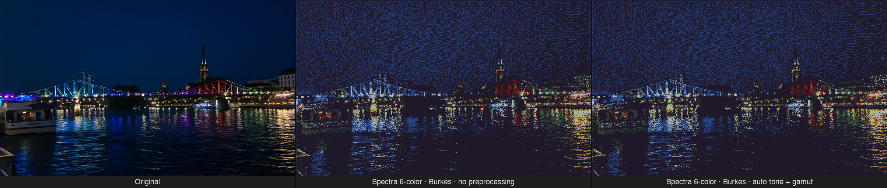
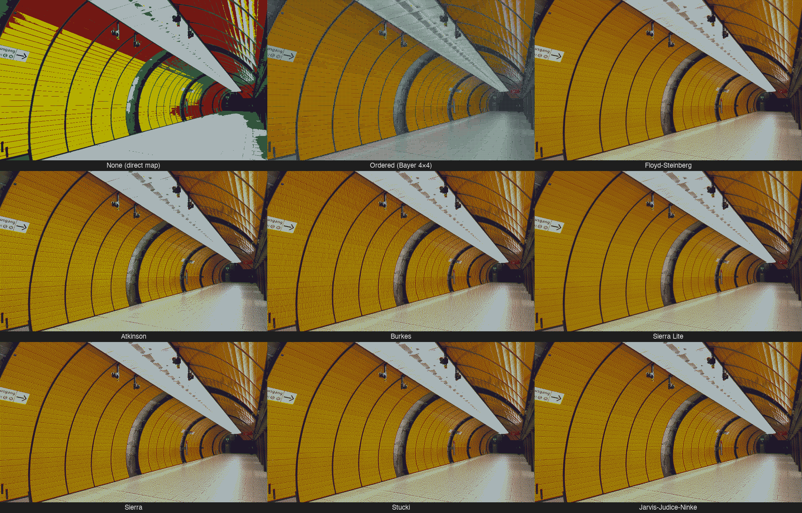
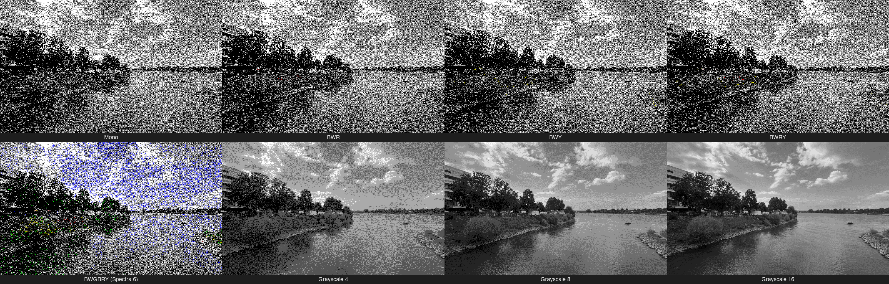

# epaper-dithering

[](https://pypi.org/project/epaper-dithering/)
[](https://www.npmjs.com/package/@opendisplay/epaper-dithering)
[](https://github.com/OpenDisplay-org/epaper-dithering/actions/workflows/python-test.yml)
[](https://github.com/OpenDisplay-org/epaper-dithering/actions/workflows/javascript-test.yml)
[](https://github.com/astral-sh/ruff)

Dithering algorithms for e-paper/e-ink displays. Rust core with Python and JavaScript/TypeScript bindings.

## Examples



**Dithering algorithms** (Spectra 6-color, Marienplatz U-Bahn station):



**Color schemes** (Burkes, river scene):



## Packages

### Python (`packages/python/`)

Published to PyPI as [`epaper-dithering`](https://pypi.org/project/epaper-dithering/).

```bash
pip install epaper-dithering
```

```python
from PIL import Image
from epaper_dithering import dither_image, ColorScheme, DitherMode, SPECTRA_7_3_6COLOR_V2

img = Image.open("photo.jpg")

# Idealized palette
dithered = dither_image(img, ColorScheme.BWR, mode=DitherMode.FLOYD_STEINBERG)

# Measured palette — auto tone + gamut compression
dithered = dither_image(img, SPECTRA_7_3_6COLOR_V2)
```

See [`packages/python/README.md`](packages/python/README.md) for full documentation.

### JavaScript/TypeScript (`packages/javascript/`)

Published to npm as [`@opendisplay/epaper-dithering`](https://www.npmjs.com/package/@opendisplay/epaper-dithering).

```bash
npm install @opendisplay/epaper-dithering
```

```typescript
import { ditherImage, ColorScheme, DitherMode, SPECTRA_7_3_6COLOR_V2 } from '@opendisplay/epaper-dithering';

// ImageBuffer from Canvas API or Node.js (sharp, etc.)
const dithered = ditherImage(imageBuffer, ColorScheme.BWR, { mode: DitherMode.BURKES });

// Measured palette — auto tone + gamut compression
const dithered = ditherImage(imageBuffer, SPECTRA_7_3_6COLOR_V2);
```

See [`packages/javascript/README.md`](packages/javascript/README.md) for full documentation.

## Features

- **Rust Core**: All dithering logic in `packages/rust/core/` — shared by both packages
- **9 Dithering Algorithms**: NONE, ORDERED, BURKES, FLOYD_STEINBERG, ATKINSON, STUCKI, SIERRA, SIERRA_LITE, JARVIS_JUDICE_NINKE
- **8 Color Schemes**: MONO, BWR, BWY, BWRY, BWGBRY (Spectra 6), GRAYSCALE_4, GRAYSCALE_8, GRAYSCALE_16
- **Measured Palettes**: Calibrated RGB values for real displays with tone + gamut compression
- **OKLab Color Matching**: Weighted Cartesian OKLab — preserves hue without the achromatic-attractor bug of LCH-weighted approaches
- **Pre-dither Knobs**: Per-image exposure, saturation, shadows, highlights, and gamut compression — all orthogonal

## Repository Structure

```
epaper-dithering/
├── packages/
│   ├── rust/
│   │   ├── core/        # Shared Rust algorithms (OKLab, dithering, tone/gamut)
│   │   └── wasm/        # wasm-bindgen bindings for JavaScript
│   ├── python/          # PyO3/maturin extension + Python wrapper
│   └── javascript/      # TypeScript wrapper + bundled WASM
├── docs/                # Calibration and color science documentation
└── .github/workflows/   # CI for all packages
```

## Development

```bash
# Python (requires Rust toolchain: https://rustup.rs)
cd packages/python
uv sync --all-extras
uv run maturin develop --release
uv run pytest tests/ -v

# JavaScript
cd packages/javascript
bun install
bun run test

# Rust
cd packages/rust
cargo test --workspace
```

## Related Projects

- **py-opendisplay**: [Python library for OpenDisplay BLE e-paper devices](https://github.com/OpenDisplay-org/py-opendisplay)
